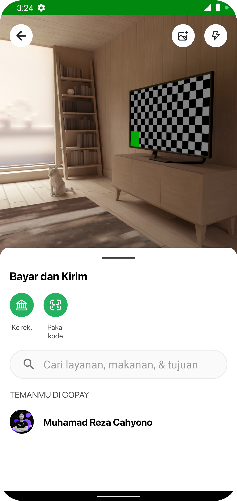

# Gojek Clone Landing Page
---
app cloning landing page about ui/ux

### Tech
- [ViewPager2](https://developer.android.com/jetpack/androidx/releases/viewpager2) - slider fragmnet in tablayout
- [CircleImageView](https://github.com/hdodenhof/CircleImageView) - build image circle
- [NavigationComponents](https://developer.android.com/guide/navigation) - Navigation simple fragment
- [CameraX](https://developer.android.com/training/camerax) - Preview camera

---

### Installation
clone github repos branch `master`
```sh
git clone git@github.com:rezacahyono/GojekClone.git
```
and you clean and run
```sh
./gradlew clean assembleDebug
```

---

### Screenshot app

| photo | photo |
|-------|-------|
|||
||    |


