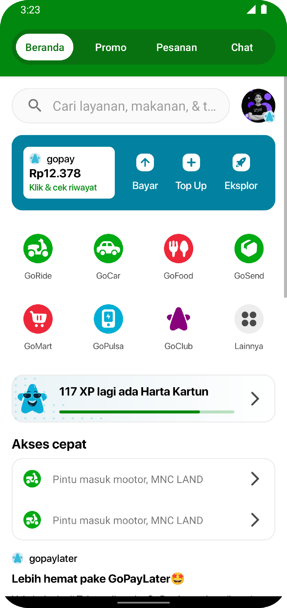

# Gojek Clone Landing Page
---
app cloning landing page about ui/ux

### Installation
clone github repos branch `master`
```sh
git clone git@github.com:rezacahyono/GojekClone.git
```
and you clean and run
```sh
./gradlew clean assembleDebug
```


### Screenshot app

| photo |       |
|-------|-------|
|||
||    |


